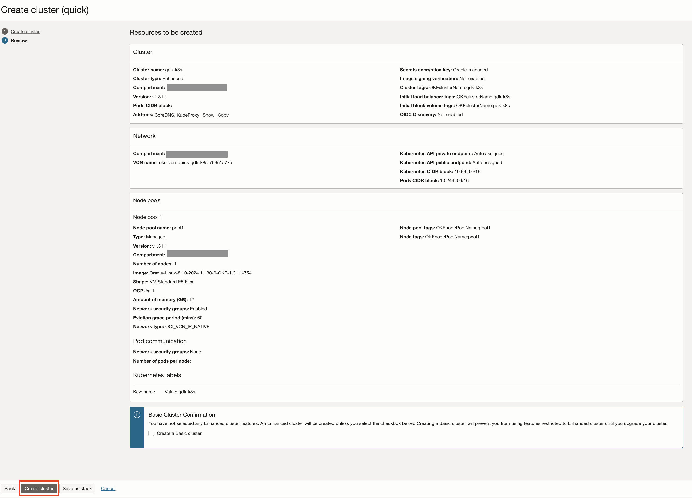

# Provision an OKE Cluster, Container Repository and Object Storage bucket

## Introduction

This lab describes the steps to create a new OCI Kubernetes Cluster(OKE), Container Repository and Object Storage bucket.

Estimated Lab Time: 10 minutes

### Objectives

In this lab, you will:

* Provision an OKE Cluster
* Provision a Container Repository
* Provision an Object Storage bucket

## Task 1: Provision an OKE Cluster

1. From the Oracle Cloud Console, open the navigation menu, click **Developer Services >> Containers & Artifacts** and then click **Kubernetes Clusters (OKE)**.

   

2. Select your workshop compartment from the **Compartment** drop down list on the left. To find the compartment name, return to the **Login Details** screen, then copy the value of the **Compartment Name**, paste it in the **Compartment** drop down list in the Oracle Cloud Console and select the filtered compartment.

    

3. Click **Create cluster**.

    

4. You will see the **Create cluster** screen with default values, select **Quick Create**, click **Submit**

    

5. Enter the name for your cluster, for example, `gdk-k8s`. Select `Public Endpoint` for the Kubernetes API endpoint; `Private Workers` for worker nodes; and select the default the shape. Click **Next**.

    

6. Review the resources to be created. Click **Create cluster**

    

    It may take a few minutes to create all the resources. When they are all complete, click **Close**.

## Task 2: Provision a Container Repository

1. From the Oracle Cloud Console, open the navigation menu, click **Developer Services >> Containers & Artifacts** and then click **Container Registry**.

   

2. Select your workshop compartment from the **Compartment** drop down list on the left. To find the compartment name, return to the **Login Details** screen, then copy the value of the **Compartment Name**, paste it in the **Compartment** drop down list in the Oracle Cloud Console and select the filtered compartment.

    

3. Click **Create repository**.

    

4. You will see the **Create repository** screen with default values. Check the **Compartment Name**, select "Private" in  the **Access**, paste "gdk-oke/os-oke" to the **Repository Name** field, click **Create**.

    

## Task 3: Provision an Object Storage Bucket

1. From the Oracle Cloud Console, open the navigation menu, click **Storage**. Under **Object Storage & Archive Storage**, click **Buckets**.

   

2. Select your workshop compartment from the **Compartment** drop down list on the left. To find the compartment name, return to the **Login Details** screen, then copy the value of the **Compartment Name**, paste it in the **Compartment** drop down list in the Oracle Cloud Console and select the filtered compartment.

   

3. Click **Create Bucket**.

4. On the **Create Bucket** screen, leave the default values unchanged and click **Create**.

   **Note:** OCI Object Storage bucket names are case-sensitive and must be unique in the tenancy.

   

   The bucket gets created in a few seconds. The next task describes how to view the bucket details.

5. On the bucket details screen, scroll down to the **Objects** list. There are no objects listed because the bucket is empty.

   

Congratulations! In this lab, you created a new OCI Kubernetes Cluster(OKE), Container Repository and Object Storage bucket in your workshop compartment.

You may now **proceed to the next lab**.

## Acknowledgements

* **Author** - 
* **Contributors** - 
* **Last Updated By/Date** - 
