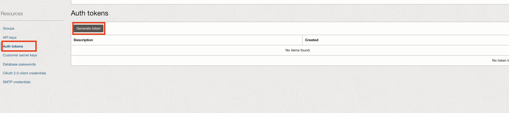
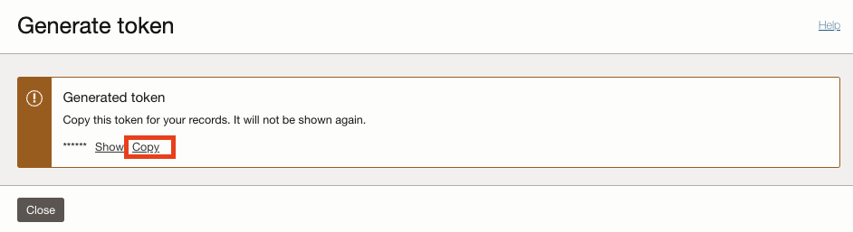

# Configure the Application

## Introduction

This lab provides instructions to configure the application to connect to the OCI Kubernetes Cluster(OKE).

The [Micronaut Oracle Cloud](https://micronaut-projects.github.io/micronaut-oracle-cloud/latest/guide/index.html) project provides integration between Micronaut applications and Oracle Cloud, including using Vault as a distributed configuration source.

Estimated Lab Time: 05 minutes

### Objectives

In this lab, you will:

* Confirm the Application dependencies
* Configure Environment Variables
* Configure the Application to connect to the Oracle Cloud Infrastructure Registry
* Configure OCI OKE Workload Identity Authentication

## Task 1: Confirm the Application properties

1. In VS Code, open `application-oraclecloud.properties`. The application configuration uses two environment variables `OCI_OS_BUCKET_NAME` and `OCI_OS_NS`.

	_oci/src/main/resources/application-oraclecloud.properties_

	``` properties
	micronaut.object-storage.oracle-cloud.default.bucket=${OCI_OS_BUCKET_NAME}
	micronaut.object-storage.oracle-cloud.default.enabled=true
	micronaut.object-storage.oracle-cloud.default.namespace=${OCI_OS_NS}
	```

## Task 2: Configure Environment Variables

1. Open a new terminal in VS Code using the **Terminal > New Terminal** menu.

2. Set the environment variable `OCI_OS_NS` to store the tenancy namespace (retrieve your tenancy namespace using the Oracle Cloud Infrastructure CLI).

	```bash
	<copy>
	export OCI_OS_NS=$(oci os ns get | jq .data -r)
	</copy>
	```

3. Confirm the value set by running the following command:

	```bash
	<copy>
	echo $OCI_OS_NS
	</copy>
	```

4. Set the environment variable `OCIR_USERNAME` to store your username in the format "tenancy_namespace/username". You can reuse `OCI_OS_NS` and only edit the "username" part.

	```bash
	<copy>
	export OCIR_USERNAME="$OCI_OS_NS/<username>"
	</copy>
	```

5. Confirm the value set by running the following command:

	```bash
	<copy>
	echo $OCIR_USERNAME
	</copy>
	```

6. Set the environment variable `OCI_REGION` to store your cloud region identifier, for example, “us-phoenix-1”.

	```bash
	<copy>
	export OCI_REGION="<region>"
	</copy>
	```

7. Confirm the value set by running the following command:

	```bash
	<copy>
	echo $OCI_REGION
	</copy>
	```

8. Set the environment variable `OCI_CLUSTER_ID` to store your OKE cluster ID.

	```bash
	<copy>
	export OCI_CLUSTER_ID="<your-cluster-id>"
	</copy>
	```

9. Confirm the value set by running the following command:

	```bash
	<copy>
	echo $OCI_CLUSTER_ID
	</copy>
	```

10. Set the environment variable `OCI_OS_OKE_IMAGE` used in in the <pom.xml>, in the docker push command, and to substitute the placeholder used in the <k8s.yml> file.
	```bash
	<copy>
	export OCI_OS_OKE_IMAGE=$OCI_REGION.ocir.io/$OCI_OS_NS/gdk-oke/os-oke:latest
	</copy>
	```

11. Confirm the value set by running the following command:

	```bash
	<copy>
	echo $OCI_OS_OKE_IMAGE
	</copy>
	```

12. Set the environment variable `K8S_NAMESPACE` to store your namespace.
	```bash
	<copy>
	export K8S_NAMESPACE=gdk-k8s
	</copy>
	```

13. Confirm the value set by running the following command:

	```bash
	<copy>
	echo $K8S_NAMESPACE
	</copy>
	```

14. Set the environment variable `OCI_OS_BUCKET_NAME` to store the bucket name you created.

	```bash
	<copy>
	export OCI_OS_BUCKET_NAME=<your bucket name>
	</copy>
	```

15. Confirm the value set by running the following command:

	```bash
	<copy>
	echo $OCI_OS_BUCKET_NAME
	</copy>
	```

16. Set the environment variable `OCI_CLI_AUTH` to run kubectl commands from an OCI instance

	```bash
	<copy>
	export OCI_CLI_AUTH=instance_principal
	</copy>
	```

17. Confirm the value set by running the following command:

	```bash
	<copy>
	echo $OCI_CLI_AUTH
	</copy>
	```

## Task 3: Configure the Application to connect to the Oracle Cloud Infrastructure Registry

1. 1. From the Oracle Cloud Console, click the **Profile** icon on the top right. Then click on **Account email**.

	

2. From the **Profile details** screen, click **Auth tokens** under **Resources**. Click **Generate token**.

	

3.  Enter a description.

4. Copy the generated token value.
	

5. In the same terminal in VS Code, set the environment variable `AUTH_TOKEN` to authenticate to OCI Registry (also known as Container Registry).

	Oracle Cloud Infrastructure restricts you to two authentication tokens at the same time. If you already have two tokens, use an existing one or delete one that you are not using.

	```bash
	<copy>
	export AUTH_TOKEN='copied value'
	</copy>
	```

6. Confirm the value set by running the following command:

	```bash
	<copy>
	echo $AUTH_TOKEN
	</copy>
	```

## Task 4: Configure OCI OKE Workload Identity Authentication

1. In VS Code, open `bootstrap-oraclecloud.properties`. The application is configured to use `OCI OKE Workload Identity Authentication` when it is running on an OCI Compute Instance.

	_oci/src/main/resources/bootstrap-oraclecloud.properties_

	```properties
	oci.config.oke-workload-identity.enabled=true
	```

2. From the Oracle Cloud Console navigation menu, go to **Identity & Security >> Identity >> Policies**.

	

4. Go to your workshop compartment.

5. Click  **Create Policy**.

6. Enter a name and description.

7. Select your workshop compartment.

8. In the **Policy Builder** section, click **Show manual editor**.

9. Enter the following policy statements in the text area. Replace the placeholders `WORKSHOP_COMPARTMENT_NAME` with your workshop compartment name, and `K8S_NAMESPACE` with the K8S_NAMESPACE environment variable value .

	```text
	<copy>
	Allow any-user to manage objects in compartment WORKSHOP_COMPARTMENT_NAME where all {request.principal.type='workload', request.principal.namespace ='K8S_NAMESPACE', request.principal.service_account = 'gdk-service-acct', request.principal.cluster_id = 'your cluster ID'}
	</copy>
	```

	To learn more about workloads access to OCI Resources, see [Granting Workloads Access to OCI Resources](https://docs.oracle.com/en-us/iaas/Content/ContEng/Tasks/contenggrantingworkloadaccesstoresources.htm).

	To learn more about the supported authentication options, see [Micronaut Oracle Cloud Authentication](https://micronaut-projects.github.io/micronaut-oracle-cloud/snapshot/guide/#authentication).

Congratulations! In this lab, you configured the application to deploy a Java Microservice to the OCI Kubernetes Cluster(OKE).

You may now **proceed to the next lab**.

## Acknowledgements

* **Author** - [](var:author)
* **Contributors** - [](var:contributors)
* **Last Updated By/Date** - [](var:last_updated)
